# fp-camin-alpro-kelompok8

## Movie Streaming Service

| NRP | Nama |
|-----|------|
| 5025211014 | Alexander Weynard Samsico |
| 5025211213 | Richie Seputro |

Aplikasi Laravel ini merupakan aplikasi layanan streaming movie yang di mana user dapat menonton movie-movie tersebut serta beberapa detail seperti Artist dan Genre. User yang berperan admin dapat juga melakukan CRUD pada movie dan artist tersebut.

## Petunjuk Penggunaan

Setelah melakukan create project dan clone repo:

1. Buatlah database dan sesuaikan namanya dengan `.env`
2. Lakukan `composer require laravel/ui`
3. Lakukan `npm install` dan `npm run build`
4. Lakukan migrasi dengan `php artisan migrate:refresh --seed`
5. Lakukan `php artisan serve` untuk mendapatkan localhost
6. Lakukan `php artisan storage:link` untuk menghubungkan storage

## Autentikasi

Sebelum pengguna dapat menggunakan layanan *streaming service*, user harus login
maupun register sebuah akun terlebih dahulu. Jika user tidak memiliki session
token, ketika user membuka endpoint '/' atau root dari page, akan di-*redirect*
ke halaman untuk login/register.

Berikut tampilan dari halaman login:

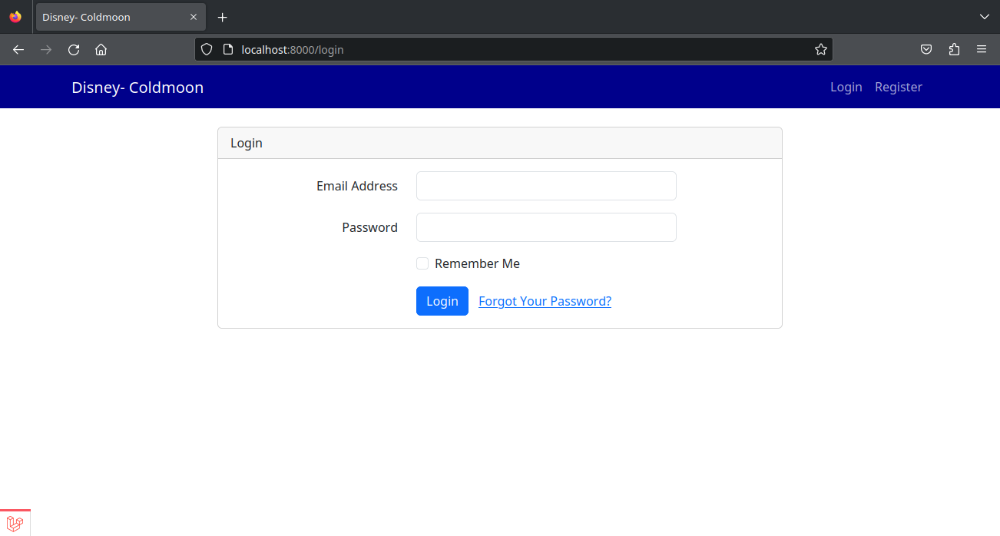

Terlihat bahwa ada 2 field yang perlu diisi, yaitu Email dan Password.

Ketika mencoba login menggunakan detail yang salah / tidak terdaftar, akan
ditampilkan:

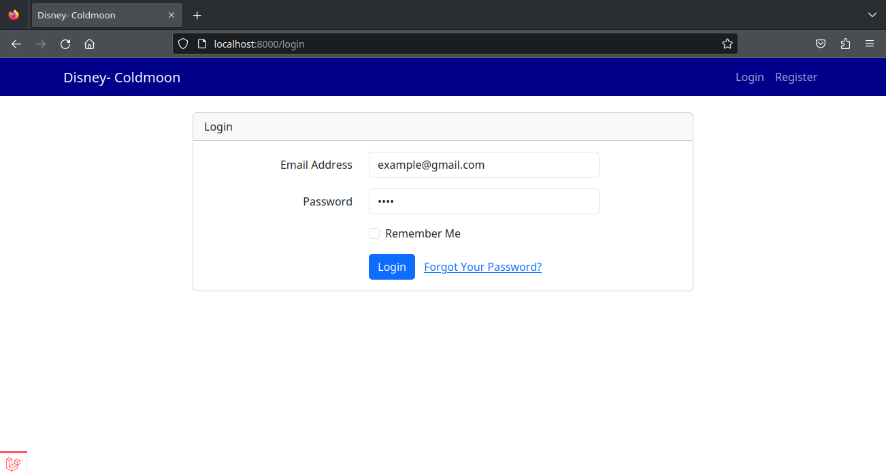

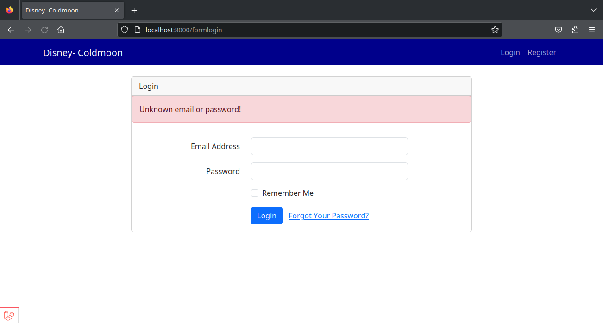

Jika user belum memiliki akun pada platform, maka user dapat melakukan register.
Berikut tampilan dari laman register:

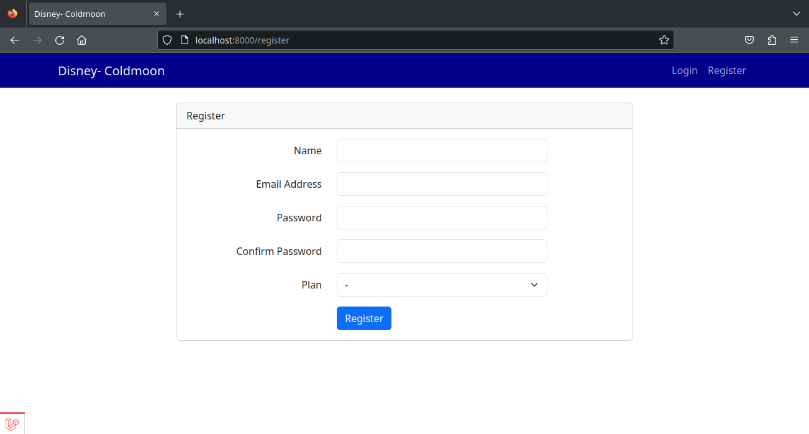

Terlihat bahwa ada 5 field yang perlu diisi, yaitu Nama, Email, Password,
Password Confirmation, dan Plan.

Setelah mencoba register dengan mengisi form, user akan di-*redirect* ke laman
*home* atau *root*:

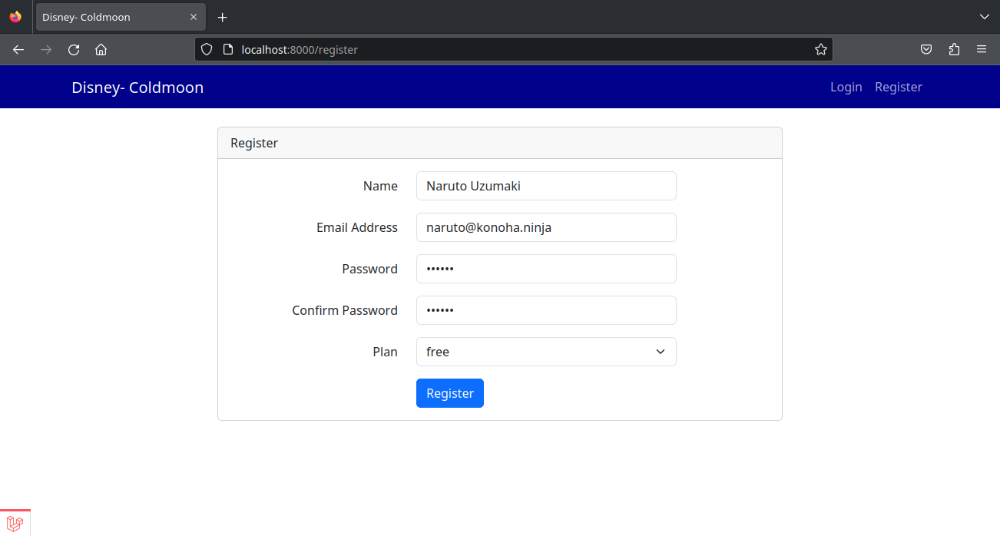

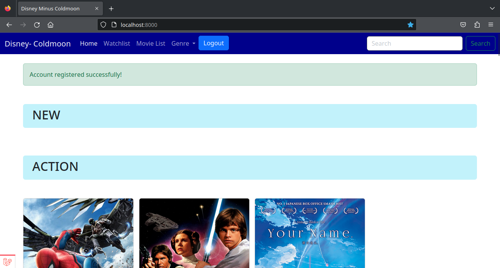

## Listing Movie

Movie yang tersedia pada platform dapat dilihat pada view Home maupun melalui
Movie List. User dapat mencapai laman Movie List dengan cara meng-klik link
"Movie List" pada navbar.

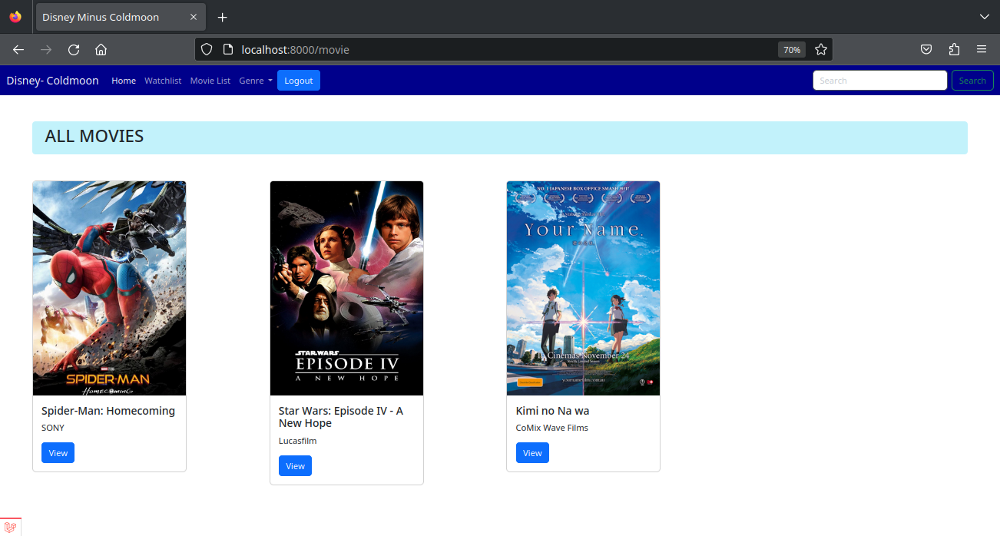

User juga dapat melihat detil film dengan meng-klik tombol view pada setiap
card movie yang tertampil.

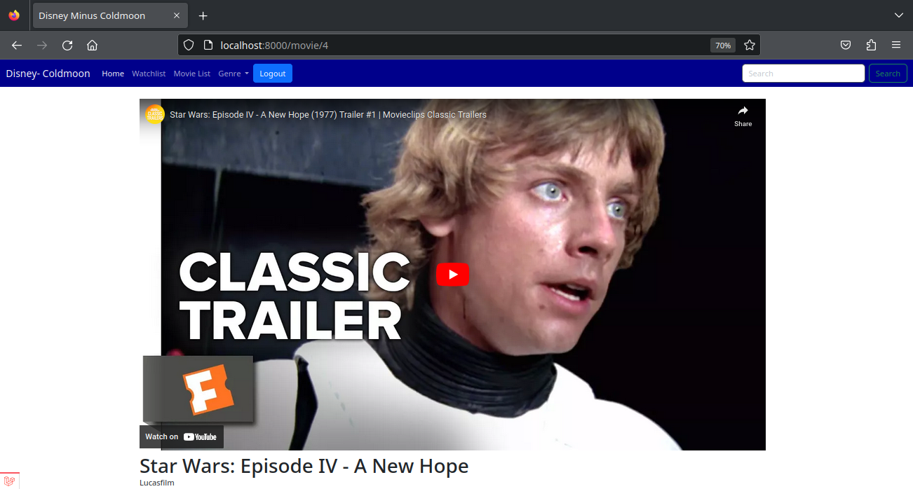

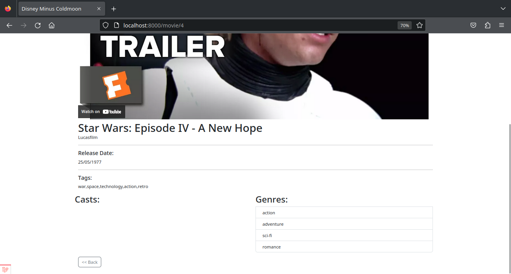

## Search by Genre

User dapat melihat daftar film dengan genre tertentu dengan meng-klik link
pada navbar bertuliskan "Genre". Setelah user meng-klik link tersebut, akan
tampil pop-up yang menampilkan genre-genre yang bisa di-*search*.

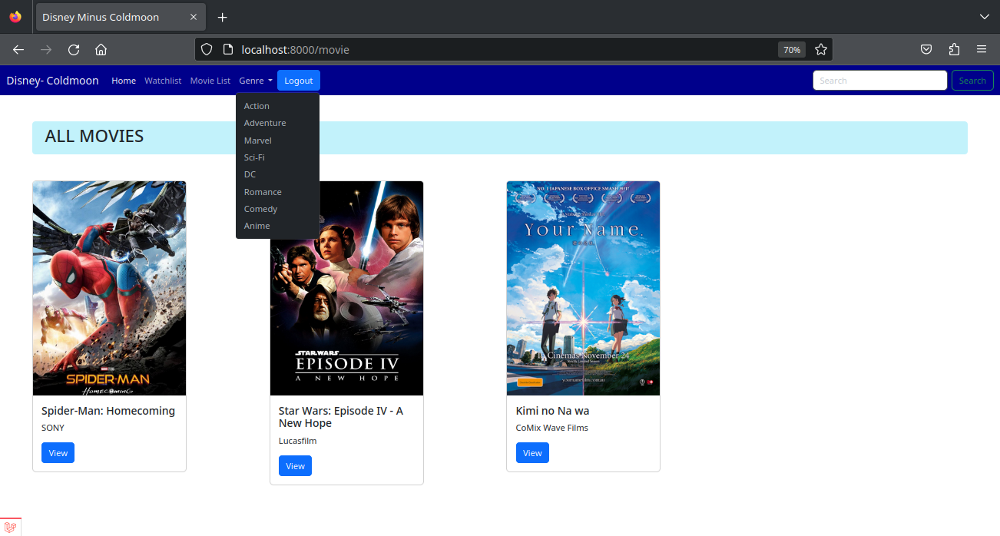

Contoh search by genre adalah seperti di bawah (genre Romance):

Contoh search by keyword ("Kimi"):

## Watchlist

User dapat melihat dan mengedit watchlist mereka. View watchlist dapat dicapai
dengan meng-klik link "Watchlist" pada navbar.

Berikut tampilan awal seorang user baru yang belum menambahkan entri ke
watchlist:

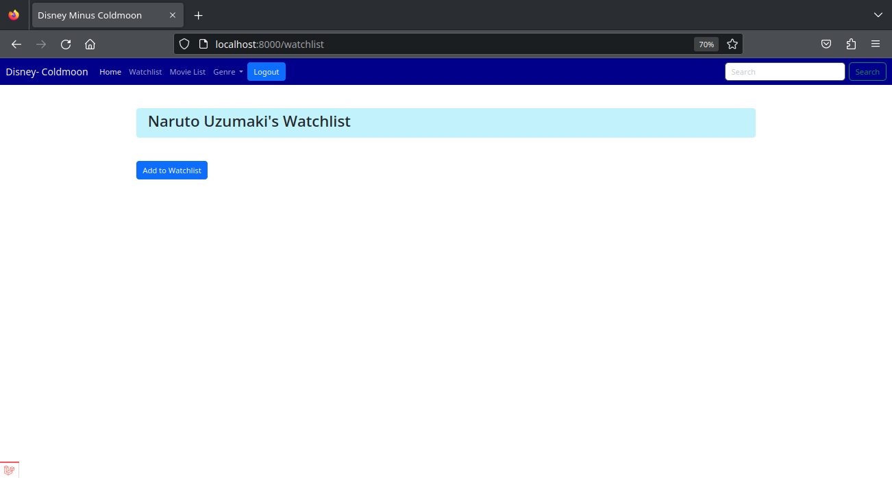

Untuk menambahkan entri watchlist baru, user dapat meng-klik tombol "Add to
Watchlist". Setelah tombol ditekan akan muncul tampilan sebagai berikut:

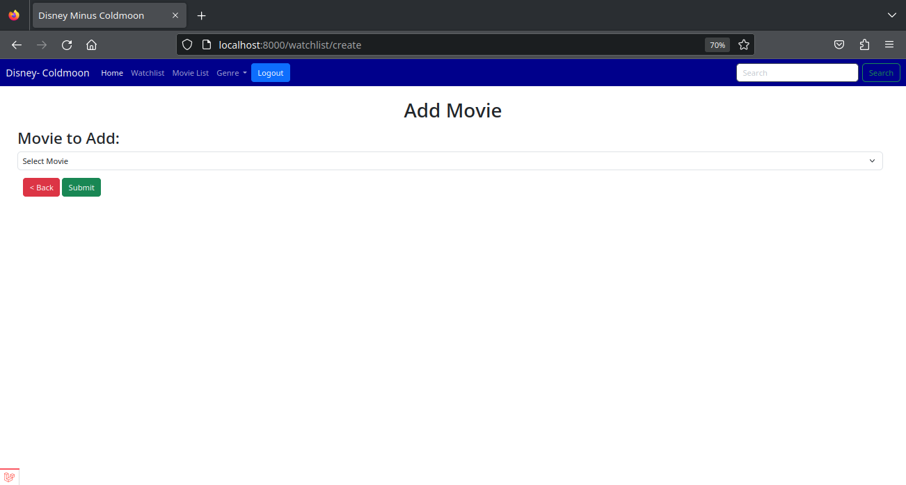

Pada tampilan itu user dapat memilih dari daftar movie yang *eligible* untuk ia
lihat untuk dimasukkan ke dalam watchlist-nya.

Setelah menambahkan entri ke watchlist, tampilan akan menjadi seperti ini:

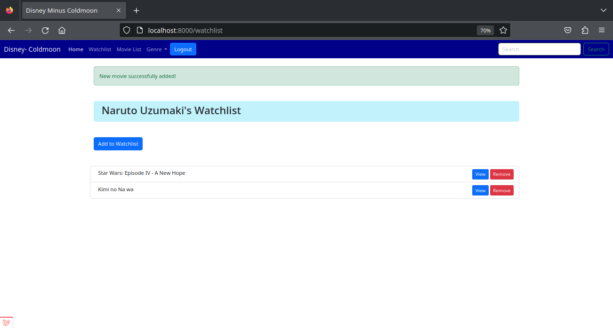

User juga dapat melakukan penghapusan terhadap entri watchlist dengan meng-klik
tombol "Remove".

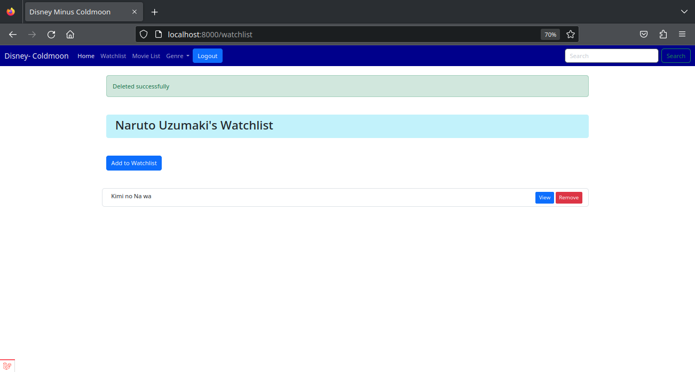

## Mode Admin

1. Tekan menu Admin\

2. Kemudian menemukan halaman sebagai berikut\

Ada beberapa fitur yang bisa diakses:

<ol>
    <li> <b>Search bar</b>: mencari movie </li>
    <li> <b>Add Movie</b>: digunakan untuk menambahkan movie </li>
    <li> <b>Artist Menu</b>: menampilkan semua artist </li>
    <li> <b>View</b>: menampilkan movie secara detail </li>
    <li> <b>Delete</b>: membuang movie dari aplikasi</li>
</ol>

### Add Movie

 Untuk menambahkan movie, diharapkan untuk mengisi title, studio, link, release date, gambar thumbnail, dan genre utama.
 Paid movie digunakan untuk mengetahui apakah movie ini berbayar atau tidak.
 Tags dapat berguna untuk pencarian movie.

 

### Artist Menu

Untuk menampilkan artist dengan birthdatenya. Admin dapat mengedit nama atau birthdate serta menghapus artist tersebut dari database (*Jika artist tersebut terdaftar dalam movie, maka data artist tersebut hilang dari movie itu*)

Edit Artist:

### View

Menampilkan movie tersebut serta beberapa detail lengkapnya seperti tags, para cast, dan genre-genrenya.

Fitur-fitur pada View sebagai berikut:

<ol>
    <li> <b>Edit</b>: digunakan untuk mengedit movie detailnya </li>
    <li> <b>Delete</b>: membuang movie dari aplikasi </li>
    <li> <b>Add Cast</b>: menambahkan artist yang ada di movie itu </li>
    <li> <b>Add Genre</b>: menambahkan genre pada movie itu</li>
    <li> <b>Remove</b>: Menghapus artist/genre dari movie itu (<i>tidak menghapus data masternya</i>)</li>
</ol>

### Add Cast

Ada dua opsi dalam penambahan cast

1. Memilih artist dari yang sudah ada dalam database
2. Menambahkan artist yang belum ada dalam database tersebut (*memasukan data artist yang baru*)

